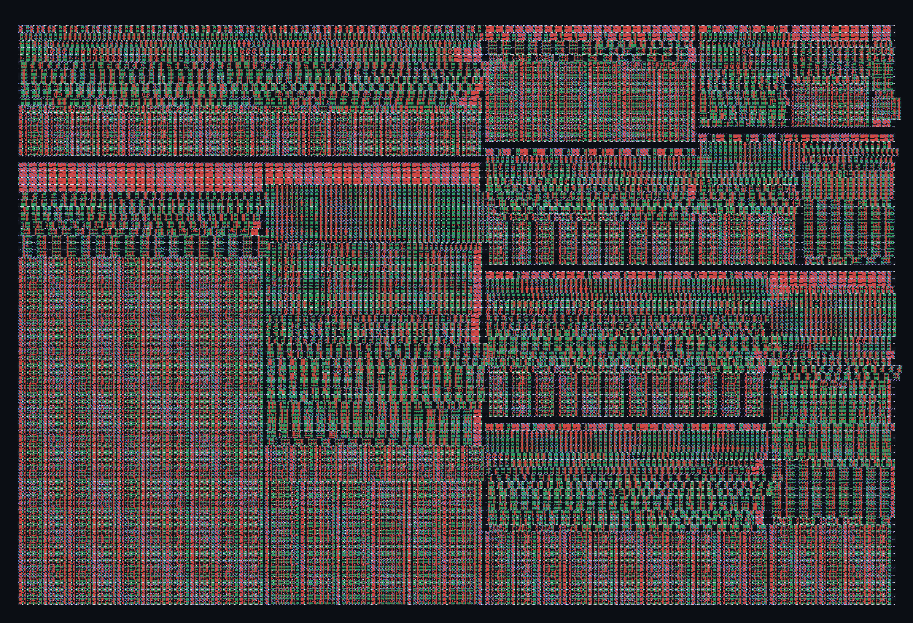

# TinyPulse-Skywater130

**A RISC-V core whose instruction set treats time as an operand.**

A Tiny Tapeout design for SkyWater sky130: a 2-stage RV32I core fused with a
hardware timebase, an ordered event-capture queue and deadline-driven trigger
outputs, joined by ten custom instructions in the RISC-V custom-0 encoding
space.

Named for what it does: emit a precise pulse at an exact moment, and stay
dark in between. `TWAIT` parks the core with fetch stopped, chip select
high and the serial clock static, while the timebase and the comparator
keep counting. Precision stays on; everything else switches off. The
`Skywater130` half names the process it is built in.

"Tiny" also places it in the Tiny Tapeout family alongside TinyQV and
TinyPID, which is where people will look for it.

---

## Contents

- [The argument](#the-argument)
- [Measured results](#measured-results)
- [Block diagram](#block-diagram)
- [Pin map](#pin-map)
- [Build profiles and the area budget](#build-profiles-and-the-area-budget)
- [Programmer's model](#programmers-model)
  - [Register file](#register-file)
  - [Address map](#address-map)
  - [Instruction formats](#instruction-formats)
  - [Complete RV32I instruction set](#complete-rv32i-instruction-set)
  - [Xpulse time extension](#xpulse-time-extension)
  - [Event word](#event-word)
  - [Status word](#status-word)
  - [Capture configuration word](#capture-configuration-word)
  - [Rate word](#rate-word)
  - [Sync register map](#sync-register-map)
- [Microarchitecture](#microarchitecture)
- [Performance](#performance)
- [Synthesis](#synthesis)
- [Place and route](#place-and-route)
- [Layout](#layout)
- [Bring-up](#bring-up)
- [Verification](#verification)
- [Building and testing](#building-and-testing)
- [File map](#file-map)
- [Known limitations](#known-limitations)

---

## The argument

A general-purpose 32-bit core on one tile loses to a $0.60 microcontroller on
every axis except novelty. So this is not a general-purpose core. It does one
thing a commodity microcontroller structurally cannot.

When you fuse sensors on a robot — an inertial measurement unit (IMU) sample,
an encoder edge, a camera shutter — what limits the result is not the sensors.
It is that you do not know *when* each reading happened. On a microcontroller
the path from a pin moving to software reading a timer runs through interrupt
latency: tens of microseconds, and crucially it *varies* from event to event.
A constant offset you can calibrate away. Jitter you cannot.

TinyPulse-Skywater130 removes software from that path entirely:

| | Microcontroller | TinyPulse-Skywater130 |
|---|---|---|
| Pin edge to timestamp | interrupt latency, 10–50 µs, variable | **2 clocks, constant** (40 ns at 50 MHz) |
| Timestamp resolution | timer tick, often 1 µs | **1 clock** (20 ns at 50 MHz) |
| Programmed time to output edge | interrupt latency, variable | **0 clocks of jitter** |
| Ordering across channels | lost if two interrupts race | **preserved by a shared queue** |
| Clock discipline | software adds an offset; timestamps can go backwards | **hardware rate slew, monotonic** |

The two-clock capture latency is the important number and so is the word
*constant*. A fixed offset can be subtracted out on the host. Jitter is
irreducible noise in every downstream filter.

### What already exists, so this does not repeat it

Pulse-width-modulation peripherals with dead-band (TT04), quadrature and
Gray-code encoder counters (TT02), TinyPID (TT02), radio-control servo
generators (TTSKY25b), and a rotary-encoder peripheral for TinyQV. Those are
the obvious robotics tiles and they are taken. Sub-microsecond timestamping
with a RISC-V instruction set built around it is not.

---

## Measured results

Every number in this section came out of `test/tb_soc.sv` and a straight-line
benchmark, running the actual RTL under Icarus Verilog. Nothing here is an
estimate.

| Measurement | Result |
|---|---|
| Trigger edge vs. programmed deadline | **exact — tick 528 programmed, tick 528 fired** |
| Capture latency, pin to queued timestamp | **2 clocks, every time** |
| Sequential instruction | **21 core clocks** |
| Taken branch (correctly predicted) | **48 core clocks** |
| Taken branch penalty | 27 clocks (deselect plus the flash stream restart) |
| Saved by a correct prediction | 21 clocks (the wrong-path fetch never happens) |
| Timebase free-run | exactly 1 tick per clock, verified over 100 clocks |
| Timebase rate trim at 2^23 | exactly 150 ticks per 100 clocks, as specified |
| Eight channels edging on one clock | all eight queued, one shared timestamp, in channel order |
| Deadline armed across the 2^32 rollover | fires on the exact tick, 1395 clocks after `TWAIT` was entered |
| **Total self-checking assertions passing** | **246 / 246** |
| cocotb tests passing | **4 / 4** |
| Verilator `-Wall` lint | **clean** |
| Yosys synthesis | **elaborates, 1,373 flip-flops, zero latches** |
| RV32I instructions executed and result-checked | **40 / 40** |
| Xpulse instructions executed and result-checked | **11 / 11** |

At 50 MHz that is 2.38 million instructions per second sustained on
straight-line code, and 2.4 million at the tile's rated clock.

The instruction rate is not the point and the README should be honest about
that. **The synchronisation hardware runs at the full core clock regardless of
what the core is doing.** While the CPU is grinding through a 21-clock fetch,
the timebase is still counting every clock, capture is still timestamping
every clock, and an armed trigger will still fire on its exact tick. That
separation is the entire architecture.

---

## Block diagram

```
                     ui_in[7:0]  CAP0..CAP7
                          │
             ┌────────────▼──────────────────────────────────┐
             │                 sync_unit                     │
             │                                               │
  uo[6] HB ◄─┤  ┌──────────────┐   ┌──────────────────────┐  │
             │  │sync_timebase │   │    sync_capture      │  │
             │  │ 32-bit count │   │  2-flop sync x8      │  │
             │  │ 24-bit frac  │   │  edge detect         │  │
             │  │ rate + step  │   └──────────┬───────────┘  │
             │  └──────┬───────┘              │              │
             │         │ now[31:0]            │ evt[7:0]     │
             │         ├──────────────────────┼───────────┐  │
             │         │                      ▼           │  │
             │         │          ┌──────────────────┐    │  │
             │         │          │ sync_event_fifo  ├────┼──┼─► uo[2] EVT
             │         │          │  shared, ordered │    │  │   uo[3] OVF
             │         │          └──────────────────┘    │  │   uio[7] EVTP
             │         ▼                                  │  │
             │  ┌──────────────┐                          │  │
             │  │ sync_compare │──────────────────────────┼──┼─► uo[0] TRIG0
             │  │  3 deadlines │                          │  │   uo[1] TRIG1
             │  └──────────────┘                          │  │   uio[6] TRIG2
             └──────▲───────────────────────▲─────────────┘  │
                    │ Xpulse port          │ MMIO port
                    │ (0 extra clocks)      │ (via the data bus)
       ┌────────────┴───────────┐    ┌──────┴──────┐
       │      tp_core       │    │ tp_bus  │
       │  ┌──────────────────┐  │    │  decode +   │
       │  │  tp_fetch    │◄─┼────┤  arbitrate  │
       │  │  PC, 1-instr buf │  │    └──────┬──────┘
       │  │  ┌────────────┐  │  │           │
       │  │  │tp_bpred│  │  │           ▼
       │  │  └────────────┘  │  │    ┌─────────────┐      uo[7]  SCK
       │  └─────────┬────────┘  │    │  qspi_ctrl  ├────► uio[0:3] SD0-3
       │            ▼           │    │  streaming  │      uio[4] CSF
       │  ┌──────────────────┐  │    │  reads      │      uio[5] CSR
       │  │ tp_decode    │  │    └─────────────┘
       │  │ tp_imm_gen   │  │
       │  │ tp_regfile   │  │      external QSPI flash  = program
       │  │ tp_alu       │  │      external QSPI PSRAM  = data + stack
       │  │ tp_shifter   │  │
       │  │ tp_branch_*  │  │
       │  │ tp_lsu       │  │
       │  │ tp_hazard    │  │
       │  └──────────────────┘  │
       └────────────────────────┘
```

Every box is its own file. The ALU is separate from the shifter is separate
from the branch comparator is separate from the branch unit is separate from
the predictor — not for tidiness, but because keeping the shifter and the
branch logic out of the ALU's adder chain is what sets the maximum clock.

---

## Pin map

All 24 signals are used. There are no spares, which is the honest situation
on a tile.

| Pin | Name | Dir | Function |
|---|---|---|---|
| `ui[0]` | CAP0 | in | Capture channel 0. **Also QSPI read latency bit 0 while reset is low.** |
| `ui[1]` | CAP1 | in | Capture channel 1. **Also read latency bit 1 at reset.** |
| `ui[2]` | CAP2 | in | Capture channel 2. **Also read latency bit 2 at reset.** |
| `ui[3]` | CAP3 | in | Capture channel 3 |
| `ui[4]` | CAP4 | in | Capture channel 4 |
| `ui[5]` | CAP5 | in | Capture channel 5 |
| `ui[6]` | CAP6 | in | Capture channel 6 |
| `ui[7]` | CAP7 | in | Capture channel 7 |
| `uo[0]` | TRIG0 | out | Deadline trigger output 0 |
| `uo[1]` | TRIG1 | out | Deadline trigger output 1 |
| `uo[2]` | EVT | out | Event queue not empty (interrupt line to a host) |
| `uo[3]` | OVF | out | Event queue overflowed, sticky |
| `uo[4]` | HALT | out | Core retired `ECALL` or `EBREAK` |
| `uo[5]` | ILL | out | An illegal instruction was decoded, sticky |
| `uo[6]` | HB | out | Heartbeat: timebase bit 23 (3.0 Hz at 50 MHz) |
| `uo[7]` | SCK | out | QSPI clock, core clock / 2 |
| `uio[0]` | SD0 | bidir | QSPI data 0 |
| `uio[1]` | SD1 | bidir | QSPI data 1 |
| `uio[2]` | SD2 | bidir | QSPI data 2 |
| `uio[3]` | SD3 | bidir | QSPI data 3 |
| `uio[4]` | CSF | out | Flash chip select, active low |
| `uio[5]` | CSR | out | PSRAM chip select, active low |
| `uio[6]` | TRIG2 | out | Deadline trigger output 2 |
| `uio[7]` | EVTP | out | One-clock pulse each time an event is queued |

`EVTP` exists so you can put a scope on it and the capture pin and measure the
two-clock latency yourself rather than taking this document's word for it.

---

## Build profiles and the area budget

**This design does not fit in a 1x1 tile with a CPU in it, and here is the
arithmetic rather than an assertion.**

A sky130 1x1 tile is 161 × 112 µm = 18,032 µm². At a realistic 60% cell
density after routing, tap cells and antenna diodes, that leaves about
**10,800 µm² of usable cell area**. In the sky130 high-density library a
`dfxtp_1` flip-flop is 19.55 µm² and a `nand2_1` is 3.75 µm². So a 1x1 tile is
roughly **2,880 gate-equivalents, or about 300 flip-flops** once you leave
room for combinational logic.

The RV32E register file alone is 16 × 32 = **512 flip-flops ≈ 10,010 µm²**. It
does not fit in a whole tile by itself, before an ALU, a decoder, a program
counter or any of the synchronisation hardware.

**Measured** flip-flop count, from `yosys -s syn/synth_check.ys`. This is
not an estimate: flip-flop count is fixed before technology mapping, so the
number is exact for this configuration.

| Block | Flip-flops | Share | ≈ µm² |
|---|---:|---:|---:|
| `tp_regfile`, 16 × 32 (RV32E) | 512 | 37% | 10,010 |
| `qspi_ctrl` | 165 | 12% | 3,226 |
| `sync_compare`, 3 channels | 163 | 12% | 3,187 |
| `tp_fetch` | 133 | 10% | 2,600 |
| `tp_core` | 115 | 8% | 2,248 |
| `sync_timebase`, FRACW=24 | 81 | 6% | 1,584 |
| `sync_event_fifo`, 2 deep | 70 | 5% | 1,369 |
| `sync_unit` | 60 | 4% | 1,173 |
| `tp_shifter`, iterative | 40 | 3% | 782 |
| `sync_capture`, 8 lanes | 24 | 2% | 469 |
| `tp_soc`, `tp_bus` | 6 | – | 117 |
| **Total** | **1,369** | | **26,764** |

Two counts appear depending on how you run it: **1,369** summed across
modules with the hierarchy preserved, and **1,373** for the flattened run
that `make synth` performs, because flattening lets a few registers be kept
rather than shared across a boundary. Use 1,373 as the budget number; the
four-flop difference changes nothing.

Synthesis also reports 10,317 generic cells before technology mapping and,
importantly, **zero inferred latches** — `syn/synth_check.ys` asserts that,
because a latch on a tile means an incomplete `always_comb` and a timing
problem nobody wants to debug in silicon.

Against the tile sizes, counting flip-flops alone:

| Tile | Usable cell area | Flip-flops use |
|---|---:|---:|
| 1x1 | 10,819 µm² | **248%** |
| 1x2 | 21,832 µm² | **123%** |
| 2x2 | 45,290 µm² | **59%** |

**So the default is 2x2, and an earlier version of this file was wrong.** It
estimated 1,198 flip-flops by hand and set `tiles: "1x2"`. The real number is
1,369, 14% higher, and the flip-flops alone overflow a 1x2 tile before a
single gate of combinational logic is placed. The hand estimate under-counted
`qspi_ctrl` by half — it missed the prefix and address registers that the
chip-select fix later made necessary — and under-counted fetch.

That is the argument for `make synth`: it takes thirty seconds and it is the
difference between ordering the right tile and the wrong one.

**Measured: 69,866 um^2 against the real sky130 library. 2x2 does not fit.**

| Tile | At 60% utilisation | At 70% | Verdict |
|---|---:|---:|---|
| 2x2 | 154% | 132% | does not fit |
| 3x2 | 101% | 87% | tight |
| 4x2 | 76% | 65% | fits |

4x2 is the smallest size with room to route; 3x2 is worth attempting since
it saves two tiles. Flip-flops are only 39% of that total — the
combinational logic is the larger half, and the register file's two
16-to-1 read multiplexers are a large part of it.

Reproduce with `cd test && make area`.

| Profile | Tiles | Cost | Parameters |
|---|---|---|---|
| **SYNC-only** | 1x1 | €70 | `HAS_CPU=0`, `NCMP=2`, `DEPTH=2`. **Not usable as built — see the warning below.** |
| **TinyPulse-Skywater130** (default) | **2x2** | **€280** | `NREG=16`, `NCMP=3`, `DEPTH=2`, `BARREL=0`, `BIMODAL=0`, `FILTW=0` — measured at 1,369 flip-flops |
| **TinyPulse-X** | 2x2 | €280 | `NCMP=4`, `DEPTH=8`, `BARREL=1`, `BIMODAL=1`, `FILTW=3` — same tile, more of everything |

All three are the same `tp_soc` module with different parameters. Nothing
else changes.

> **The 1x1 SYNC-only profile does not work as written, and you should not
> order a tile for it yet.** With `HAS_CPU=0` there is no core, so nothing
> drives the memory-mapped port — and the pins carry capture inputs and
> trigger outputs only. Capture is disabled out of reset and there is no way
> to enable it or to read a timestamp back. The profile elaborates and lints,
> and it is genuinely empty.
>
> Making it real needs a serial host port, which is not written. Without a
> CPU the four QSPI data pins and both chip selects are free, so a
> peripheral-interface (SPI) slave on `uio[0:3]` reaching the same
> `reg_req`/`reg_addr`/`reg_we` interface `tp_bus` already drives would
> do it, at maybe 120 flip-flops. That is the concrete next task if the €70
> slot is the one you want.
>
> The 1x2 and 2x2 profiles are both fully tested and work.

---

## Programmer's model

### Register file

TinyPulse implements the **RV32E** register set: 16 registers, `x0` hardwired to
zero. This is a deliberate choice rather than an arbitrary one — RV32E is a
ratified RISC-V base, so a stock toolchain targets it directly:

```
riscv32-unknown-elf-gcc -march=rv32e -mabi=ilp32e
```

| Register | ABI name | Role under ilp32e |
|---|---|---|
| `x0` | `zero` | Hardwired zero |
| `x1` | `ra` | Return address |
| `x2` | `sp` | Stack pointer |
| `x3` | `gp` | Global pointer |
| `x4` | `tp` | Thread pointer |
| `x5`–`x7` | `t0`–`t2` | Temporaries, caller-saved |
| `x8` | `s0`/`fp` | Saved / frame pointer |
| `x9` | `s1` | Saved |
| `x10`–`x11` | `a0`–`a1` | Arguments and return values |
| `x12`–`x15` | `a2`–`a5` | Arguments |

Register specifiers above `x15` are illegal in RV32E. TinyPulse **ignores bit 4
of every specifier** (so `x17` reads as `x1`) and raises the sticky `ILL`
status bit on `uo[5]`. It does not trap: a trap handler needs control and
status registers, and CSRs cost a tile. There are no CSRs in this design.

### Address map

Decoded on `addr[31:28]`.

| Range | Device | Notes |
|---|---|---|
| `0x0000_0000`–`0x0FFF_FFFF` | External QSPI flash | Program. Instruction fetch and read-only data. Reset vector is `0x0000_0000`. |
| `0x1000_0000`–`0x1FFF_FFFF` | External QSPI PSRAM | Writable data, stack |
| `0x2000_0000`–`0x2FFF_FFFF` | Sync unit registers | 11 words, see the register map below |
| everything else | unmapped | Reads return zero |

### Instruction formats

All six RV32I formats, with the bit positions exactly as the base
specification defines them. The scrambled layouts of the B and J immediates
exist so that every immediate bit always comes from a fixed instruction bit,
which makes the sign-extension wiring free.

```
 31        25 24     20 19     15 14    12 11         7 6            0
┌────────────┬─────────┬─────────┬────────┬────────────┬──────────────┐
│   funct7   │   rs2   │   rs1   │ funct3 │     rd     │    opcode    │  R
└────────────┴─────────┴─────────┴────────┴────────────┴──────────────┘

 31                  20 19     15 14    12 11         7 6            0
┌──────────────────────┬─────────┬────────┬────────────┬──────────────┐
│      imm[11:0]       │   rs1   │ funct3 │     rd     │    opcode    │  I
└──────────────────────┴─────────┴────────┴────────────┴──────────────┘

 31        25 24     20 19     15 14    12 11         7 6            0
┌────────────┬─────────┬─────────┬────────┬────────────┬──────────────┐
│  imm[11:5] │   rs2   │   rs1   │ funct3 │  imm[4:0]  │    opcode    │  S
└────────────┴─────────┴─────────┴────────┴────────────┴──────────────┘

 31    30   25 24     20 19     15 14    12 11    8   7 6            0
┌───┬─────────┬─────────┬─────────┬────────┬───────┬───┬──────────────┐
│i12│imm[10:5]│   rs2   │   rs1   │ funct3 │im[4:1]│i11│    opcode    │  B
└───┴─────────┴─────────┴─────────┴────────┴───────┴───┴──────────────┘

 31                                      12 11         7 6            0
┌──────────────────────────────────────────┬────────────┬──────────────┐
│                imm[31:12]                │     rd     │    opcode    │  U
└──────────────────────────────────────────┴────────────┴──────────────┘

 31   30           21  20  19            12 11         7 6            0
┌───┬─────────────────┬───┬────────────────┬────────────┬──────────────┐
│i20│    imm[10:1]    │i11│   imm[19:12]   │     rd     │    opcode    │  J
└───┴─────────────────┴───┴────────────────┴────────────┴──────────────┘
```

Both branch and jump immediates are **multiples of two** — bit 0 is always
zero and is not stored. TinyPulse has no compressed extension, so every
instruction is 4 bytes and the low two bits of every target are zero.

### Complete RV32I instruction set

All 40 base instructions are implemented. "DX cycles" is time spent in the
execute stage, not counting the 21-clock instruction fetch.

#### Upper immediate

| Instruction | Fmt | opcode | funct3 | funct7 | Operation | DX cycles |
|---|---|---|---|---|---|---|
| `LUI rd, imm` | U | `0110111` | – | – | `rd = imm << 12` | 1 |
| `AUIPC rd, imm` | U | `0010111` | – | – | `rd = pc + (imm << 12)` | 1 |

#### Jumps

| Instruction | Fmt | opcode | funct3 | funct7 | Operation | DX cycles |
|---|---|---|---|---|---|---|
| `JAL rd, off` | J | `1101111` | – | – | `rd = pc+4; pc += off` | 1 |
| `JALR rd, rs1, imm` | I | `1100111` | `000` | – | `rd = pc+4; pc = (rs1+imm) & ~1` | 1 |

#### Branches

| Instruction | Fmt | opcode | funct3 | funct7 | Operation | DX cycles |
|---|---|---|---|---|---|---|
| `BEQ rs1, rs2, off` | B | `1100011` | `000` | – | `if (rs1 == rs2) pc += off` | 1 |
| `BNE rs1, rs2, off` | B | `1100011` | `001` | – | `if (rs1 != rs2) pc += off` | 1 |
| `BLT rs1, rs2, off` | B | `1100011` | `100` | – | signed `<` | 1 |
| `BGE rs1, rs2, off` | B | `1100011` | `101` | – | signed `>=` | 1 |
| `BLTU rs1, rs2, off` | B | `1100011` | `110` | – | unsigned `<` | 1 |
| `BGEU rs1, rs2, off` | B | `1100011` | `111` | – | unsigned `>=` | 1 |

`funct3` values `010` and `011` are reserved and decode as illegal.

#### Loads

| Instruction | Fmt | opcode | funct3 | funct7 | Operation | DX cycles |
|---|---|---|---|---|---|---|
| `LB rd, off(rs1)` | I | `0000011` | `000` | – | `rd = sext(mem8)` | bus |
| `LH rd, off(rs1)` | I | `0000011` | `001` | – | `rd = sext(mem16)` | bus |
| `LW rd, off(rs1)` | I | `0000011` | `010` | – | `rd = mem32` | bus |
| `LBU rd, off(rs1)` | I | `0000011` | `100` | – | `rd = zext(mem8)` | bus |
| `LHU rd, off(rs1)` | I | `0000011` | `101` | – | `rd = zext(mem16)` | bus |

#### Stores

| Instruction | Fmt | opcode | funct3 | funct7 | Operation | DX cycles |
|---|---|---|---|---|---|---|
| `SB rs2, off(rs1)` | S | `0100011` | `000` | – | `mem8 = rs2[7:0]` | bus |
| `SH rs2, off(rs1)` | S | `0100011` | `001` | – | `mem16 = rs2[15:0]` | bus |
| `SW rs2, off(rs1)` | S | `0100011` | `010` | – | `mem32 = rs2` | bus |

"bus" is 1 clock for a sync-unit address and a full QSPI transaction
(roughly 40 clocks) for PSRAM.

#### Register–immediate

| Instruction | Fmt | opcode | funct3 | funct7 | Operation | DX cycles |
|---|---|---|---|---|---|---|
| `ADDI rd, rs1, imm` | I | `0010011` | `000` | – | `rd = rs1 + imm` | 1 |
| `SLTI rd, rs1, imm` | I | `0010011` | `010` | – | signed set-less-than | 1 |
| `SLTIU rd, rs1, imm` | I | `0010011` | `011` | – | unsigned set-less-than | 1 |
| `XORI rd, rs1, imm` | I | `0010011` | `100` | – | `rd = rs1 ^ imm` | 1 |
| `ORI rd, rs1, imm` | I | `0010011` | `110` | – | `rd = rs1 \| imm` | 1 |
| `ANDI rd, rs1, imm` | I | `0010011` | `111` | – | `rd = rs1 & imm` | 1 |
| `SLLI rd, rs1, shamt` | I | `0010011` | `001` | `0000000` | `rd = rs1 << shamt` | shamt+2 |
| `SRLI rd, rs1, shamt` | I | `0010011` | `101` | `0000000` | logical right | shamt+2 |
| `SRAI rd, rs1, shamt` | I | `0010011` | `101` | `0100000` | arithmetic right | shamt+2 |

For the shift-immediate forms `shamt` occupies `inst[24:20]` and `funct7`
occupies `inst[31:25]`.

#### Register–register

| Instruction | Fmt | opcode | funct3 | funct7 | Operation | DX cycles |
|---|---|---|---|---|---|---|
| `ADD rd, rs1, rs2` | R | `0110011` | `000` | `0000000` | `rd = rs1 + rs2` | 1 |
| `SUB rd, rs1, rs2` | R | `0110011` | `000` | `0100000` | `rd = rs1 - rs2` | 1 |
| `SLL rd, rs1, rs2` | R | `0110011` | `001` | `0000000` | `rd = rs1 << rs2[4:0]` | shamt+2 |
| `SLT rd, rs1, rs2` | R | `0110011` | `010` | `0000000` | signed set-less-than | 1 |
| `SLTU rd, rs1, rs2` | R | `0110011` | `011` | `0000000` | unsigned set-less-than | 1 |
| `XOR rd, rs1, rs2` | R | `0110011` | `100` | `0000000` | `rd = rs1 ^ rs2` | 1 |
| `SRL rd, rs1, rs2` | R | `0110011` | `101` | `0000000` | logical right | shamt+2 |
| `SRA rd, rs1, rs2` | R | `0110011` | `101` | `0100000` | arithmetic right | shamt+2 |
| `OR rd, rs1, rs2` | R | `0110011` | `110` | `0000000` | `rd = rs1 \| rs2` | 1 |
| `AND rd, rs1, rs2` | R | `0110011` | `111` | `0000000` | `rd = rs1 & rs2` | 1 |

#### Memory ordering and environment

| Instruction | Fmt | opcode | funct3 | imm | Operation | DX cycles |
|---|---|---|---|---|---|---|
| `FENCE` | I | `0001111` | `000` | – | Retires as a no-op. There is one core, one bus and no cache, so there is nothing to order. | 1 |
| `ECALL` | I | `1110011` | `000` | `000000000000` | Halts the core, `HALT` (`uo[4]`) goes high | halts |
| `EBREAK` | I | `1110011` | `000` | `000000000001` | Halts the core | halts |

There is no Zicsr extension. `CSRRW`, `CSRRS`, `CSRRC` and their immediate
forms decode as illegal and set `ILL`.

That is **40 instructions**.

### Xpulse time extension

Ten instructions, all in the RISC-V **custom-0** opcode space `0001011`, all
using the R-type field layout. This encoding space is reserved by the RISC-V
specification for exactly this purpose, so these coexist with a standard
toolchain — `sw/tinypulse.h` emits every one of them through the GNU assembler's
`.insn` directive with no patched binutils.

```
 31        25 24     20 19     15 14    12 11         7 6            0
┌────────────┬─────────┬─────────┬────────┬────────────┬──────────────┐
│   funct7   │   rs2   │   rs1   │ funct3 │     rd     │   0001011    │
└────────────┴─────────┴─────────┴────────┴────────────┴──────────────┘
      sub-op                        which          result
```

| Instruction | funct3 | funct7 | rd | rs1 | rs2 | Operation | DX cycles |
|---|---|---|---|---|---|---|---|
| `TIME rd` | `000` | `0000000` | dest | – | – | `rd = timebase` | 1 |
| `TPOP rd` | `001` | `0000000` | dest | – | – | `rd =` oldest queued event, and pop it. Reads 0 if empty. | 1 |
| `TSTAT rd` | `010` | `0000000` | dest | – | – | `rd = ` status word | 1 |
| `TWAIT rs1` | `011` | `0000000` | – | deadline | – | **Block until `timebase >= rs1`**, then resume | until the deadline |
| `TARM rs1, rs2` | `100` | `0000000` | – | deadline | channel | Arm trigger `rs2[1:0]` to fire at `rs1` | 1 |
| `TPULSE rs1` | `101` | `0000000` | – | mask | – | Fire trigger channels in `rs1[2:0]` now | 1 |
| `TMARK rd, rs1` | `110` | `0000000` | dest | tag | – | Push a software event with tag `rs1[2:0]`; `rd = ` its timestamp | 1 |
| `TADJ rs1` | `111` | `0000000` | – | delta | – | Step the timebase by signed `rs1`, in one clock | 1 |
| `TRATE rs1` | `111` | `0000001` | – | rate | – | Set the fractional rate (see the rate word) | 1 |
| `TCFG rs1` | `111` | `0000010` | – | cfg | – | Capture enable and edge select | 1 |
| `TPW rs1` | `111` | `0000011` | – | ticks | – | Trigger pulse width, shared by all channels | 1 |

That is **10 instructions**, and **50 in total** with RV32I.

#### Why these and not memory-mapped registers

Every one of them is *also* reachable as a load or store to `0x2000_0000`.
The instruction form exists because of what it costs:

| Access | Clocks | Path |
|---|---|---|
| `TIME rd` | **0 extra** | The timebase lands in a register in the same clock the instruction retires |
| `lw rd, 0(base)` | 1 + address setup | Out over the data bus and back |

In a control loop that reads the clock every iteration, that difference is the
whole reason to build a custom core instead of buying a microcontroller.

#### `TWAIT` in particular

```asm
    time  x1                 # x1 = now
    addi  x2, x0, 1000
    add   x3, x1, x2         # deadline = now + 1000 ticks
    tarm  x3, x0             # trigger 0 will fire on that exact tick
    twait x3                 # core parks; resumes on that exact tick
```

The core stops fetching and its execute stage sits in `EX_WAIT` until the
comparison succeeds. There is no interrupt to take, no handler prologue, no
return. The deadline comparison is a **signed difference**, so it stays
correct across the timebase's 2³² rollover:

```systemverilog
reached = ($signed(now - deadline) >= 0);
```

### Event word

What `TPOP` and a read of `SR_EVENT` return. 32 bits:

```
 31   30    28  27  26                                              0
┌───┬──────────┬───┬──────────────────────────────────────────────────┐
│src│ channel  │edg│                timestamp[26:0]                   │
└───┴──────────┴───┴──────────────────────────────────────────────────┘
```

| Field | Bits | Meaning |
|---|---|---|
| `src` | 31 | 0 = hardware capture, 1 = software `TMARK` |
| `channel` | 30:28 | Capture channel 0–7, or the `TMARK` tag |
| `edg` | 27 | 1 = rising edge, 0 = falling |
| `timestamp` | 26:0 | Low 27 bits of the timebase at the moment of capture |

27 bits wraps every 2.68 s at 50 MHz and 2.10 s at 64 MHz. To rebuild a full
32-bit time: read `TIME`, replace its low 27 bits with the event's, and if the
result is greater than the `TIME` reading, subtract 2²⁷ — the event happened
before the rollover.

Holding the full 32 bits would have cost 5 more flip-flops per queue entry for
no practical gain; you re-read `TIME` far more often than once every two
seconds.

### Status word

What `TSTAT` and a read of `SR_STAT` return:

| Bits | Field | Meaning |
|---|---|---|
| 3:0 | `count` | Entries currently in the event queue |
| 4 | `empty` | Queue is empty |
| 5 | `full` | Queue is full |
| 6 | `overflow` | An event was lost because the queue was full. **Sticky.** |
| 7 | – | Reserved |
| 11:8 | `armed` | One bit per compare channel, set while armed |
| 15:12 | `trig` | One bit per compare channel, set while the output pulse is high |
| 23:16 | `levels` | Live synchronised state of the 8 capture pins |
| 31:24 | – | Reserved |

Check `overflow` in any loop that drains the queue. With a 2-entry queue and
8 channels it is reachable, and a silently dropped event is worse than a
reported one.

### Capture configuration word

Written by `TCFG rs1` or a store to `SR_CFG`:

| Bits | Field | Meaning |
|---|---|---|
| 7:0 | `enable` | One bit per channel; 0 means the channel produces no events |
| 15:8 | `falling` | One bit per channel; 1 captures the falling edge instead of the rising |
| 16 | `both` | Capture both edges on every enabled channel (overrides `falling`) |
| 31:17 | – | Reserved, write zero |

### Rate word

Written by `TRATE rs1` or a store to `SR_RATE`:

| Bits | Field | Meaning |
|---|---|---|
| 23:0 | magnitude | Fractional ticks per clock, in units of 2⁻²⁴ |
| 30:24 | – | Reserved |
| 31 | sign | 0 = run fast (add a tick on overflow), 1 = run slow (skip one) |

One count is 2⁻²⁴ tick per clock ≈ **0.0596 parts per million**. Writing the
rate resets the fractional accumulator, so successive writes do not
accumulate phase error.

Use `TADJ` once at startup to jump the clock into rough agreement, then
`TRATE` from then on. A step can make a timestamp go backwards and every
filter downstream of it will see a negative time delta; a slew cannot.

### Sync register map

Base `0x2000_0000`. Word offset is `addr[5:2]`.

| Offset | Address | Name | R/W | Contents |
|---|---|---|---|---|
| 0 | `0x2000_0000` | `SR_TIME` | R | Current 32-bit timebase |
| 1 | `0x2000_0004` | `SR_EVENT` | R | Oldest event. **Reading pops it.** |
| 2 | `0x2000_0008` | `SR_STAT` | R | Status word |
| 3 | `0x2000_000C` | `SR_CFG` | W | Capture configuration word |
| 4 | `0x2000_0010` | `SR_CMP0` | W | Arm compare channel 0 with this deadline |
| 5 | `0x2000_0014` | `SR_CMP1` | W | Arm compare channel 1 with this deadline |
| 6 | `0x2000_0018` | – | – | Unmapped. Writes are ignored, reads return zero. |
| 7 | `0x2000_001C` | `SR_PW` | W | Trigger pulse width in ticks |
| 8 | `0x2000_0020` | `SR_ADJ` | W | Signed one-shot step of the timebase |
| 9 | `0x2000_0024` | `SR_RATE` | W | Fractional rate word |
| 10 | `0x2000_0028` | `SR_PULSE` | W | Fire trigger channels in `wdata[2:0]` now |

Note that `SR_CMP2` has no memory-mapped alias — the third compare channel is
reachable only through `TARM rs1, rs2` with `rs2 = 2`. Widening the
memory-mapped decode was not worth the gates.

---

## Microarchitecture

### The pipeline

```
   ┌──────────────┐        ┌───────────────────────────────────┐
   │      F       │        │                DX                 │
   │ fetch + pred │───────►│ decode, read, execute, write back │
   └──────────────┘        └───────────────────────────────────┘
```

Two stages. Everything in DX — register read, ALU, writeback — happens in one
clock for the common case.

### Why there is no forwarding unit

Because a read-after-write hazard cannot occur. Both register reads and the
register write happen inside DX in the same cycle, so two instructions are
never in the read stage and the write stage simultaneously. Removing
forwarding removes two 32-bit multiplexers from the critical path and about
200 gate-equivalents from the area.

`tp_hazard.sv` exists anyway, as the single place the stall and flush
policy lives, and its header says all of this so nobody later "fixes" the
missing forwarding.

### What sets the clock

The critical path is:

```
register file read → ALU 33-bit adder → writeback mux → register file write
```

Three things are deliberately kept off it:

1. **Shifts** live in `tp_shifter`, not the ALU. A 32-bit barrel shifter
   in the ALU would add a five-level multiplexer network in parallel with the
   adder and roughly 500 gate-equivalents. The iterative shifter costs
   `shamt+2` clocks instead and keeps the adder chain alone on the path.
2. **Branch comparison** lives in `tp_branch_comp`, which starts the
   moment the operands are read and does not wait for the ALU result mux.
3. **Target formation** reuses the same ALU adder — `A = PC` (or `rs1` for
   `JALR`), `B = immediate` — rather than adding a second 32-bit adder. The
   link value `PC+4` comes from a separate narrow incrementer.

The ALU itself shares **one 33-bit adder** across `ADD`, `SUB`, `SLT` and
`SLTU`; the 33rd bit is the carry-out that `SLTU` needs, and the signed
comparison is overflow-safe by checking the sign bits rather than trusting
the difference.

Signoff target for the 1x2 build is 50 MHz, which is the clock Tiny Tapeout
guarantees through the tile multiplexer. Synthesis on this style of datapath
in sky130 typically closes well above that; the usable board clock is limited
by the harness, not by this logic. **Sweep it in synthesis and believe the
static timing report, not this paragraph.**

### Branch prediction, and why it earns its area here

`tp_bpred.sv` is a pre-decode predictor: it looks at the instruction word
as it lands in the fetch buffer and computes the next fetch address directly
from the immediate field. There is no branch target buffer because the target
is computable, so there is nothing to cache.

- `BIMODAL=0` (default): static backwards-taken / forwards-not-taken. **Zero
  flip-flops.**
- `BIMODAL=1` (2x2 build): 16 two-bit saturating counters indexed by
  `pc[5:2]`, 32 flip-flops.

The payoff is unusually large here because fetch dominates. **Measured: a
correct prediction saves 21 clocks**, because the wrong-path fetch never
happens. On a conventional core a misprediction costs a couple of pipeline
bubbles; here it costs a whole flash transaction.

DX redirects only when its resolved next-PC differs from the address fetch
already went after, so a correct prediction costs literally nothing.

### QSPI streaming, and where the speed comes from

There is **no on-chip program memory and there cannot be one**: 32 words of
instruction RAM built from flip-flops is 1,024 flops, more than an entire 1x2
tile. So code streams from external flash.

| Transaction | Sequence | sck cycles |
|---|---|---|
| Flash read, cold | `addr[23:0]` (6 nibbles) + mode `0xA0` (2) + 4 dummy + 8 data | 20 |
| Flash read, **streaming** | 8 data nibbles, chip select never rises | **8** |
| PSRAM read | `0xEB` (2) + `addr[23:0]` (6) + 6 dummy + 8 data | 22 |
| PSRAM write | `0x38` (2) + `addr[23:0]` (6) + 2 per byte | 10–16 |

The flash is left in continuous read mode, so a sequential fetch keeps chip
select low and clocks out the next word with no preamble: **8 cycles instead
of 20, a 2.5× speedup on straight-line code.** A taken branch is what makes
you pay the preamble back, which is precisely why the predictor exists.

Byte order, because this is where these designs usually break: the flash
streams ascending addresses and RV32 is little-endian, so **the first byte on
the wire is the least significant byte of the word**, high nibble first.

---

## Performance

At 50 MHz core clock, 25 MHz QSPI clock, all measured on the RTL:

| Quantity | Value |
|---|---|
| Sequential instruction | 21 clocks = 420 ns |
| Sustained straight-line rate | **2.38 MIPS** |
| Taken branch | 48 clocks = 960 ns |
| Load or store to PSRAM | ~62 clocks |
| Load or store to a sync register | 22 clocks (21 fetch + 1) |
| Any Xpulse instruction except `TWAIT` | 21 clocks (fetch only) |
| `SLLI` by 8 | 31 clocks |
| Timestamp resolution | **1 clock = 20 ns** |
| Capture latency | **2 clocks = 40 ns, constant** |
| Trigger jitter | **0 clocks** |
| Rate trim resolution | 0.0596 ppm |
| Timebase rollover | 85.9 s (full 32-bit), 2.68 s (event timestamp field) |

Of the 21 clocks per instruction, 16 are the QSPI data phase and 5 are
handshake overhead between the fetch state machine, the bus arbiter and the
QSPI controller. Overlapping fetch with execute would recover about 4 of
those — roughly a 19% instruction-rate gain — at the cost of a second 32-bit
instruction buffer, 64 flip-flops, about 1,250 µm². On a 1x2 tile that is a
bad trade; on the 2x2 profile it is worth revisiting.

---

## Synthesis

Reproduce with `cd test && make synth`, which runs `syn/synth_check.ys`.
This is a technology-independent elaboration, so the cell counts are
generic — but the **flip-flop count is exact**, because it is fixed before
technology mapping.

```
flip-flops          1,373     (1,369 with hierarchy preserved)
generic cells      10,071
inferred latches        0     asserted, not hoped
```

Zero latches matters: a latch on a tile means an incomplete `always_comb`
and a timing problem nobody wants to debug in silicon. `syn/synth_check.ys`
fails the run if one appears.

Per-module flip-flops, which is what decides the tile count:

| Module | Flip-flops | Share |
|---|---:|---:|
| `tp_regfile` | 512 | 37% |
| `qspi_ctrl` | 165 | 12% |
| `sync_compare` (3 channels) | 163 | 12% |
| `tp_fetch` | 133 | 10% |
| `tp_core` | 115 | 8% |
| `sync_timebase` | 81 | 6% |
| `sync_event_fifo` | 70 | 5% |
| `sync_unit` | 60 | 4% |
| `tp_shifter` | 40 | 3% |
| `sync_capture` | 24 | 2% |
| `tp_soc`, `tp_bus` | 6 | – |
| **Total** | **1,369** | |

**Requires Yosys 0.44 or newer.** Older builds cannot parse file-scope
`import` and will fail on the first module. If `yosys -V` reports less than
that, `pip install --break-system-packages yowasp-yosys` gets a current
build.

---

## Place and route

**Not yet run. This section is a placeholder and the numbers below are
blank on purpose — do not cite them until they are filled in.**

Place and route needs the sky130 PDK and the LibreLane flow, which means it
has to run on a machine with the PDK installed. `docs/HARDENING.md` is the
full walkthrough. Once it completes, fill in the table from
`runs/<latest>/reports/`:

| Quantity | Value | Where to read it |
|---|---|---|
| Standard cells after mapping | *(fill in)* | `reports/synthesis/*stat*.rpt` |
| Total cell area (µm²) | *(fill in)* | same |
| Die area / tile count | *(fill in)* | floorplan log |
| Core utilisation | *(fill in)* | floorplan log; above ~70% routing gets hard |
| Setup worst negative slack | *(fill in)* | `reports/signoff/*sta*.rpt` — **must be positive** |
| Setup total negative slack | *(fill in)* | same — should be zero |
| Hold worst slack | *(fill in)* | same — **must be positive** |
| Achieved clock | *(fill in)* | derived from setup slack |
| Critical path | *(fill in)* | STA report |
| DRC violations | *(fill in)* | **must be zero** |
| LVS violations | *(fill in)* | **must be zero** |
| Antenna violations | *(fill in)* | a few auto-fixed is normal |

Two things to check rather than skim:

**The critical path should be** register file read → the 33-bit adder in
`tp_alu` → writeback multiplexer → register file write. The whole
microarchitecture is arranged to put it there: the shifter, the branch
comparator and target formation are all deliberately off that path. If STA
reports something else as critical, an assumption in the
[Microarchitecture](#microarchitecture) section is wrong and it is worth
chasing rather than papering over.

**Compare the flip-flop count** against the 1,373 above. A large
disagreement means a configuration difference, not a rounding difference.

To generate it:

```bash
cd ~/tinypulse-skywater130/test && make lint && make sim && make synth
# then follow docs/HARDENING.md
```

---

## Layout

**No render yet.** A GDSII layout only exists after place and route, so
this section fills in at the same time as the one above.

Once the flow has produced a GDS:

```bash
sudo apt install klayout

klayout -e -nn ~/.volare/sky130A/libs.tech/klayout/tech/sky130A.lyt \
        runs/<latest>/final/gds/tt_um_normansrule_tinypulse.gds
```

The `.lyt` gives KLayout the sky130 layer colours; without it every layer
renders the same shade and the image is useless.

To export an image for this README: **File → Save View As Image**, PNG,
around 2000 px wide, then save it as `docs/images/layout.png` and replace
this paragraph with:

```markdown

```

What to look at, rather than just admiring it:

1. **The outline** — the design must sit inside the tile boundary with
   power rails reaching the edges where the harness expects them.
2. **Density** — even is good; large empty regions beside congested ones
   mean placement struggled.
3. **The register file** — 512 flip-flops, 37% of the design. It should
   appear as a large regular block. Smeared across the whole tile means
   routing is fighting it.
4. **Metal 1 and metal 2 congestion** — turn off the upper layers and look
   for areas where the lower ones are completely full.

Use the hierarchy browser in the left panel to jump straight to
`u_soc.g_cpu.u_core.u_rf`.

---

## Bring-up

**Read this section before you power the board.** Most of it is one setting.

### 1. The QSPI read latency is the thing most likely to be wrong

A real flash launches its output on the falling edge of the clock, and the
data arrives one to three cycles later than the idealised model assumes. If
the controller samples at the wrong moment, every instruction it fetches is
garbage and the chip looks dead.

TinyPulse samples a three-bit latency value from `ui[2:0]` **while reset is
held**, exactly so this is fixable on the bench instead of frozen into the
mask:

```
hold rst_n low
drive ui[2:0] = latency (try 0, then 1, 2, 3, ...)
release rst_n
watch uo[6] for a heartbeat
```

Once reset releases, `ui[2:0]` go back to being capture channels 0–2.

If no value produces a heartbeat, put a scope on `uo[7]` (SCK) and
`uio[0:3]` and check that the flash is answering at all.

### 2. Put the flash in continuous read mode first

The controller does not send a read opcode. It sends the address followed by
the mode byte `0xA0`, which is what keeps a flash in continuous read mode.
Your board's host (or a one-time setup with an external programmer) has to put
the flash into that mode before the core starts fetching.

### 3. Programming the flash

```
make -C sw camera_sync.bin
# then write camera_sync.bin to flash offset 0 with your programmer
```

The reset vector is `0x0000_0000`, which is the first word of the flash.
`sw/crt0.S` must be first in the image — `sw/link.ld` places `.text.init`
there.

### 4. Health signals, in the order to check them

| Pin | Meaning if wrong |
|---|---|
| `uo[6]` HB | Not toggling → the clock is not reaching the tile |
| `uo[5]` ILL | High → the core is decoding garbage, almost certainly the read latency |
| `uo[4]` HALT | High immediately → the first word fetched decoded as `ECALL`; the flash is returning zeros or the byte order is wrong |
| `uo[3]` OVF | High → events are arriving faster than software drains them |
| `uo[2]` EVT | Never high → check `TCFG`; channels are disabled out of reset |

### 5. Measuring the claims yourself

Put a scope on a capture pin and on `uio[7]` (EVTP). The delay between them is
the capture latency, and it should be two clock periods every single time. Put
a scope on `uo[0]` (TRIG0) and compare against your own reference — the edge
should land on the programmed tick with no spread across repetitions.

That second measurement, against the same function implemented on an RP2040,
is the whole argument for this chip in one oscilloscope screenshot.

---

## Verification

Being precise about what has and has not been proven, because "it compiles" is
not verification.

### What was run and passed

| Testbench | Checks | What it covers |
|---|---:|---|
| `test/tb_unit.sv` | 88 | Each block standalone |
| `test/tb_soc.sv` | 12 | Boots a program, checks trigger timing |
| `test/tb_isa.sv` | 51 | Every RV32I instruction against expected results |
| `test/tb_stress.sv` | 18 | Simultaneous capture, queue overflow, rollover |
| `test/tb_wrap.sv` | 10 | System-level 2^32 rollover |
| `test/tb_xpulse.sv` | 16 | All eleven Xpulse instructions executed |
| `test/tb_profile.sv` | 51 | The whole ISA test against the 2x2 profile |
| **Total** | **246** | **all passing** |

Full coverage matrix, claim-by-claim traceability and the complete list of
what has *not* been verified: **`docs/VERIFICATION.md`**.

Verilator `--lint-only -Wall` is clean, with no waivers. The four cocotb
tests in `test/test.py` pass as well (`cd test && make`), and
`yosys -s syn/synth_check.ys` elaborates the design, reports 1,369
flip-flops and asserts that no latches were inferred.

`tb_isa.sv` deserves a note on method. `sw/mkisa.py` assembles a
168-instruction program that exercises all 40 RV32I instructions and stores
49 results into the PSRAM, and it computes the expected value of each one in
Python — different language, different arithmetic, written from the
specification rather than from the RTL. The testbench compares the two. Two
independent implementations agreeing is worth far more than a testbench that
checks the hardware against itself.

`tb_profile.sv` runs that same program against `BARREL=1` and `BIMODAL=1`,
because a parameter you never simulate is a parameter that does not work.

`tb_unit.sv` exercises each block standalone, including the cases a program is
unlikely to reach: signed and unsigned compare boundaries around
`0x8000_0000`, a shift by zero, a queue overflow, a timebase rate trim
verified against an exact expected tick count, and the capture latency
measured rather than assumed.

`tb_soc.sv` is a full-system test. It boots a real program out of a
behavioural QSPI flash, and checks:

- the core reaches `ECALL` and halts
- no illegal instruction was decoded along the way
- the event queue did not overflow
- **the trigger edge lands on the exact programmed tick** (tick 528
  programmed, tick 528 fired)
- the queued event has the right source, channel and edge polarity
- the capture timestamp is within the synchroniser latency of the real pin
  edge
- `TMARK`'s software timestamp is ordered correctly against the hardware one

### Bugs these tests caught

Worth listing, because they are the argument for running the tests and the
linter rather than reading the code. The last two would each have produced
dead silicon.

1. The bus held its request high during the cycle the QSPI controller answered,
   so the controller — already back in its idle state — started the same
   transaction a second time.
2. The iterative shifter returned a stale accumulator when the shift amount
   was zero.
3. Sub-word PSRAM writes dropped the byte offset, so `SB` wrote to the wrong
   address.
4. The trigger output was one tick late. The comparator now fires against
   `now + 1` so the registered output edge lands on the programmed tick. Left
   unfixed, the datasheet's zero-jitter claim would have been false by one
   tick — constant and harmless in practice, but wrong.
5. **A combinational loop through the register file.** The register file had
   a same-cycle write-through bypass, which is normal in a deeper pipeline
   and catastrophic in this one: because the read and the write belong to the
   same instruction, `addi x1, x1, 1` fed its own result back as its own
   operand. Verilator flagged it as `UNOPTFLAT`; Icarus had simulated it
   without complaint because no test had yet used an instruction whose
   destination was also its source. It was a combinational loop in synthesis
   and the wrong answer in simulation. The bypass is gone and `tb_isa.sv`
   now covers `rd == rs1` explicitly.
6. **The design would not have synthesized at all.** The original RTL used
   SystemVerilog packed structs and typedef'd enums as module ports — the
   house style, and perfectly good style. Yosys's native Verilog frontend,
   which is what the hardening flow runs, accepts neither: it passes roughly
   half of a standard SystemVerilog construct suite, and these constructs are
   in the failing half. The design simulated flawlessly and would have died
   at the first synthesis step unless the `yosys-slang` plugin happened to be
   present. The control bundle is now a packed vector with the field order
   documented once in `tp_pkg.sv`, the enums are localparams, and the
   branch comparator returns three signals instead of a struct. All 207
   assertions passed unchanged after the refactor, which is what the suite
   was for.
7. **Every taken branch fetched garbage.** After a taken branch the
   controller issued a new address while chip select was still low from the
   open continuous-read stream. A real flash treats those clocks as more of
   the stream, so the instruction stream came back two bytes misaligned and
   stayed that way. The controller now deselects for `CS_HIGH` clocks before
   any non-sequential access, which is also what the part's tSHSL timing
   requires. This one cost three clocks per taken branch to fix and would
   have cost a shuttle slot to discover.

### What has NOT been done

- **No synthesis has been run.** Every area number in this document is
  computed from library cell sizes, not from a real report. The tile count
  is a prediction. Run OpenLane or LibreLane before you commit to a shuttle.
- **No static timing analysis.** The 50 MHz target is a target.
- **No formal verification.** The properties worth proving — "an armed
  compare always fires exactly once", "no event is dropped while the queue has
  room" — are stated but not proven. `tb_stress.sv` tests both by directed
  simulation, which is weaker. This is the obvious next step and it suits the
  design: they are simple safety properties over small state.
- **No gate-level simulation.**
- **No hardening run against the sky130 PDK.** Synthesis proves the RTL
  elaborates and fixes the flip-flop count, but area, timing and routability
  all need the real flow. `docs/HARDENING.md` is the walkthrough.
- **The 1x1 `HAS_CPU=0` profile is empty**, as described above. It
  elaborates and lints; it has no way in or out.
- **The QSPI models are mine.** `test/qspi_model.sv` implements the protocol
  `qspi_ctrl` expects, so the two agree by construction. That is enough to
  catch sequencing and byte-order bugs — it caught the chip-select bug above
  — but it cannot catch a disagreement between my understanding of a real
  flash and the real flash. Read the datasheet for the part you actually
  solder down, especially the continuous-read mode entry and tSHSL.

---

## Building and testing

### Simulation — start here

```bash
sudo apt install iverilog verilator
cd test
make sim          # all seven self-checking testbenches, 246 assertions
make lint         # Verilator -Wall, must be clean
make synth        # Yosys elaboration and the real flip-flop count
```

`make synth` needs Yosys 0.44 or newer for file-scope `import`. Debian and
Ubuntu ship older versions that cannot parse the design at all; if
`yosys -V` says less than 0.44, `pip install --break-system-packages
yowasp-yosys` gets a current build.

Individually:

```bash
make unit         # 88 block-level checks
make soc          # 12 system checks: trigger timing against a real program
make isa          # 51 checks: every RV32I instruction vs. expected results
make stress       # 18 checks: simultaneous capture, overflow, rollover
make wrap         # 10 checks: TWAIT and compare across the 2^32 wrap
make xpulse       # 16 checks: every Xpulse instruction executed
make profile      # the ISA test against the 2x2 build profile
make prog         # regenerate all three .hex programs from sw/
```

### The Tiny Tapeout cocotb flow

```bash
pip install cocotb
cd test
make              # cocotb + Icarus, the flow the GitHub Action runs
```

### Building software

```bash
cd sw
make              # needs riscv32-unknown-elf-gcc
```

`sw/tinypulse.h` gives you every Xpulse instruction as an inline function with
no toolchain patching. `sw/camera_sync.c` is a worked example: shutter at a
fixed rate, timestamp the strobe return and an IMU data-ready line against the
same clock, report the skew.

### Hardening

Push to GitHub with the Tiny Tapeout GDS action enabled, or harden locally per
<https://tinytapeout.com/guides/local-hardening/>. **Read the area report and
update `tiles` in `info.yaml` to whatever it actually needs.**

---

## File map

```
tinypulse-skywater130/
├── README.md                          this file
├── LICENSE                            Apache-2.0
├── info.yaml                          Tiny Tapeout metadata and pinout
├── docs/
│   ├── info.md                        the datasheet page
│   ├── HARDENING.md                   synthesis, place and route, KLayout
│   ├── VERIFICATION.md                coverage matrix and what is unproven
│   └── images/                        put the KLayout render here
├── syn/
│   ├── synth_check.ys                 Yosys elaboration + flop count
│   └── stat.txt                       the last run's statistics
├── src/
│   ├── tp_pkg.sv                  opcodes, types, register offsets
│   ├── tp_soc.sv                  core + bus + QSPI + sync
│   ├── tt_um_normansrule_tinypulse.sv Tiny Tapeout pin wrapper
│   ├── core/
│   │   ├── tp_alu.sv              one shared 33-bit adder
│   │   ├── tp_shifter.sv          iterative or barrel, parameterised
│   │   ├── tp_branch_comp.sv      eq / signed lt / unsigned lt
│   │   ├── tp_branch_unit.sv      funct3 + comparison -> taken
│   │   ├── tp_bpred.sv            static or bimodal prediction
│   │   ├── tp_regfile.sv          16 x 32, 2 read 1 write
│   │   ├── tp_imm_gen.sv          I / S / B / U / J immediates
│   │   ├── tp_decode.sv           all 50 instructions -> ctrl_t
│   │   ├── tp_hazard.sv           stall and flush policy
│   │   ├── tp_lsu.sv              byte lanes, strobes, sign extension
│   │   ├── tp_fetch.sv            PC, instruction buffer, redirect
│   │   └── tp_core.sv             glue and the execute state machine
│   ├── sync/
│   │   ├── sync_timebase.sv           counter + fractional rate + step
│   │   ├── sync_capture.sv            synchronisers, filter, edge detect
│   │   ├── sync_event_fifo.sv         the shared ordered event queue
│   │   ├── sync_compare.sv            deadlines -> trigger pulses
│   │   └── sync_unit.sv               registers and both access paths
│   └── bus/
│       ├── tp_bus.sv              address decode and arbitration
│       └── qspi_ctrl.sv               external flash and PSRAM
├── test/
│   ├── Makefile                       make sim / make lint / per-test targets
│   ├── tb_unit.sv                     65 block-level checks
│   ├── tb_soc.sv                      12 system checks
│   ├── tb_isa.sv                      51 instruction-set checks
│   ├── tb_stress.sv                   18 simultaneous-capture and wrap checks
│   ├── tb_wrap.sv                     10 system-level rollover checks
│   ├── tb_xpulse.sv                   16 Xpulse instruction checks
│   ├── tb_profile.sv                  the ISA test on the 2x2 profile
│   ├── qspi_model.sv                  behavioural flash and PSRAM
│   ├── prog.hex                       the trigger-timing program
│   ├── isa.hex, isa_expect.txt        the ISA program and its expectations
│   ├── wrap.hex                       the rollover program
│   ├── tb.v                           cocotb wrapper, TT standard shape
│   └── test.py                        cocotb tests
└── sw/
    ├── tinypulse.h                       Xpulse from C via .insn
    ├── mkprog.py                      the tiny assembler
    ├── mkisa.py                       ISA program + independent expectations
    ├── mkwrap.py                      the rollover program
    ├── mkxpulse.py                    the Xpulse coverage program
    ├── crt0.S                         reset entry
    ├── link.ld                        flash / PSRAM memory map
    ├── camera_sync.c                  worked example
    └── Makefile                       rv32e build
```

---

## Known limitations

Stated plainly rather than discovered later.

- **Yosys 0.44 or newer is required.** The RTL deliberately avoids
  typedef'd enums and packed structs on ports so it synthesizes with the
  native Verilog frontend, but file-scope `import` still needs a reasonably
  current Yosys.
- **No multiply or divide.** A 32-bit multiplier is 2,000+ gate-equivalents,
  most of a 1x1 tile. Use shifts and adds.
- **No compressed instructions.** Adding RVC would nearly halve the fetch
  time, which on a fetch-bound core is the single biggest performance win
  available. It costs a decoder expansion and unaligned fetch handling. This
  is the first thing I would add on a 2x2.
- **No control and status registers, so no traps and no interrupts.** Illegal
  instructions set a sticky status bit and execution continues. `ECALL` halts.
- **RV32E only**, 16 registers. `x16`–`x31` alias into `x0`–`x15` with `ILL`
  raised.
- **Event timestamps are 27 bits**, wrapping every 2.68 s at 50 MHz.
- **The event queue is 2 entries deep** in the default build. Eight capture
  channels can outrun it. Watch the overflow bit.
- **The third trigger channel has no memory-mapped alias** — `TARM` only.
- **Fetch and execute do not overlap**, costing about 4 clocks per instruction.
- **Unaligned loads and stores are not supported** and are not detected. The
  address is truncated to a word boundary. RV32I permits implementations to
  trap on these; TinyPulse has no trap mechanism, so it silently truncates.
  Do not do unaligned accesses.
- **The flash must already be in continuous read mode.** The controller has no
  mode-entry sequence of its own.
- **The 1x1 SYNC-only profile has no host interface** and is not usable
  without one. See the build profiles section.
- **Chip select is deasserted for `CS_HIGH` clocks before every
  non-sequential access.** The default of 2 gives 40 ns at 50 MHz, which
  clears the tSHSL of the parts I checked. Verify it against yours; raising
  it only costs clocks on taken branches.

---

## Licence

Apache-2.0. See `LICENSE`.
