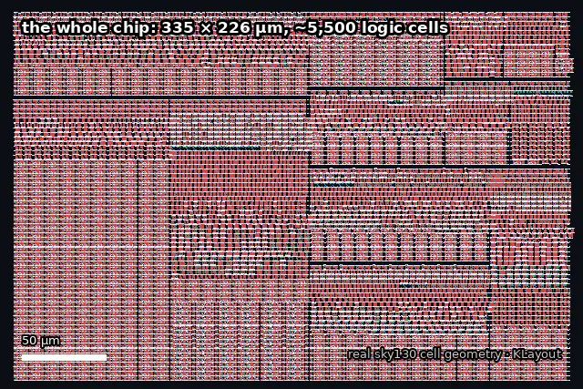
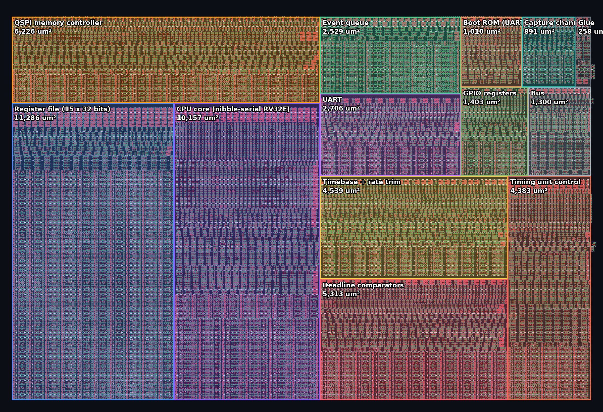
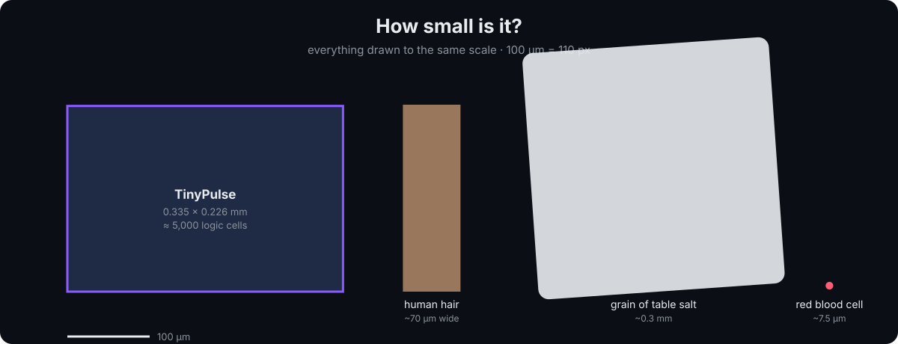
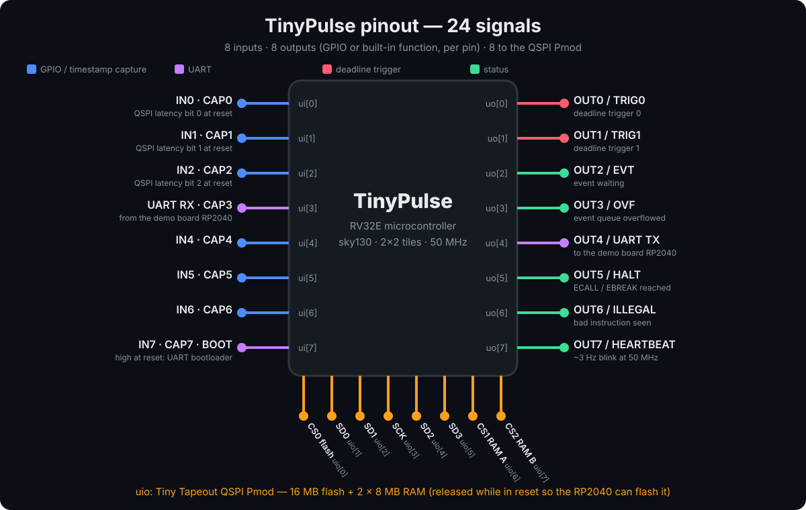
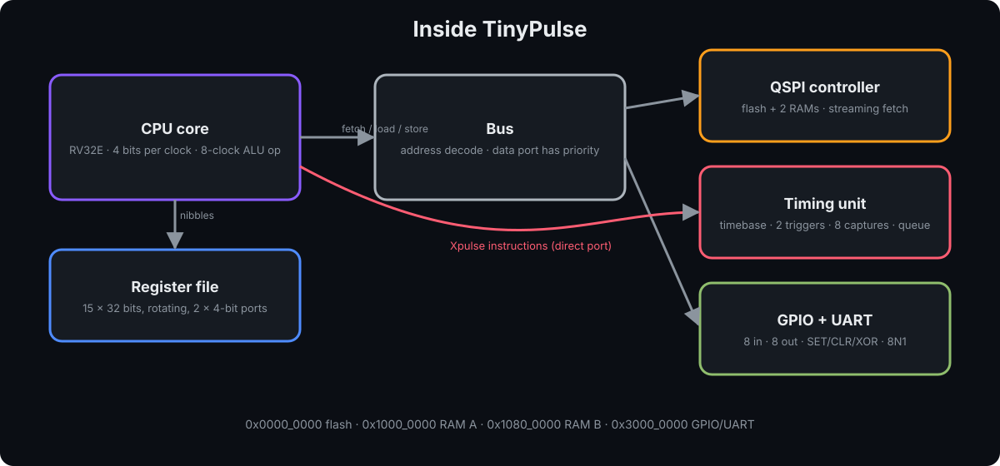
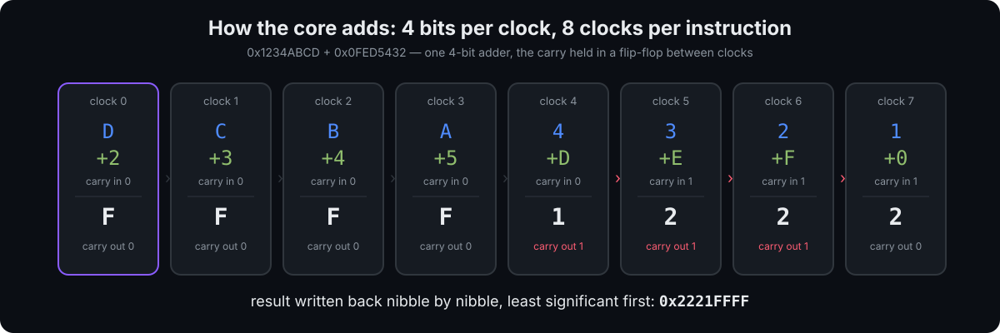

# TinyPulse — a RISC-V microcontroller the size of a grain of salt




<sub>From the whole chip to single transistors: the design's ~5,500 real sky130 logic cells,
drawn from SkyWater's own cell geometry with KLayout (`docs/tools/zoom_animation.py`).</sub>

**A complete 32-bit microcontroller in 0.075 mm² of silicon — two Tiny Tapeout tiles, 280 €.**
It runs RISC-V code from a 16 MB flash chip — or straight from a USB serial link, no
programmer needed — has 16 MB of RAM, 8 inputs, 8 outputs, a
UART for `printf`, and something no ordinary microcontroller has: **instructions that treat
time as an operand.** It timestamps pin edges in hardware, fires output pulses on an exact
clock tick with zero jitter, and can be disciplined to an external reference.

| | |
|---|---|
| **Instruction set** | RV32E (all 37 base instructions) + 11 **Xpulse** timing instructions |
| **Core** | nibble-serial: 4 bits per clock, 15 × 32-bit registers |
| **Clock** | 50 MHz target; 20 ns timestamp resolution |
| **Memory** | 16 MB QSPI flash (code) + 2 × 8 MB QSPI RAM (data), via the Tiny Tapeout QSPI Pmod |
| **I/O** | 8 inputs · 8 outputs · UART on the demo board's USB bridge |
| **Timing** | 32-bit timebase with rate trim · 2 deadline triggers · 8 capture channels · event queue |
| **Programming** | through the demo board's own USB-C port, a USB-UART adapter, or the flasher |
| **Timing** | 6.9 ns worst logic path against 20 ns at 50 MHz (estimate from real cell delays) |
| **Area** | 49,186 µm² of standard cells, measured against the real sky130 library |
| **Cost** | 2 × 2 Tiny Tapeout tiles = 280 € |
| **Verification** | 226 self-checking assertions, 6 cocotb tests, and **37/37 official RISC-V architecture tests**, RTL **and** gate-level |

## What it looks like

**The real, routed chip.** Every push runs Tiny Tapeout's full hardening flow on GitHub, which
places and wires every cell and publishes the result. Once the first `gds` run finishes, the
image below is the actual layout that goes to the fab, and
[this link opens it in 3D](https://normansrule.github.io/tinypulse-skywater130/):


<sub>(If that image is missing, the `gds` workflow hasn't run yet, or GitHub Pages isn't
enabled: Settings → Pages → Source: GitHub Actions.)</sub>

**Before routing, block by block.** Every cell of the synthesized design, placed by block
inside the 334.9 × 225.8 µm tile — the register file's regular grid of flip-flops on the left,
the irregular logic of the CPU beside it:



**One flip-flop, taken apart.** The register file is 480 copies of this cell. Its real
manufacturing layers — N-well, diffusion, polysilicon gates, contacts, local interconnect, vias,
metal 1 — separate and rejoin:



## Explore it interactively

[**Open the chip explorer**](https://htmlpreview.github.io/?https://github.com/Normansrule/tinypulse-skywater130/blob/main/docs/explorer.html)
(or open `docs/explorer.html` from a clone): zoom from the whole tile down to transistors,
click any of the 24 pins to see what it does, step a 32-bit addition through the nibble adder
one clock at a time, and browse all 48 instructions with their bit-level encodings.

## How small?



The whole chip — CPU, 480 flip-flops of registers, memory controller, timing unit, UART and
GPIO — is about 335 µm across. A strand of hair is about 70 µm wide; a grain of table salt is
about 300 µm.


<sub>A 24 × 14 µm window into the register file: real sky130 D flip-flops. Red is
polysilicon (transistor gates), green is diffusion, white squares are contacts, blue
hatching is local interconnect. Every other row is mirrored so neighbours share a power rail.</sub>

## Pinout



| Pin | Function | Pin | Function (reset) / GPIO |
|---|---|---|---|
| `ui[0]` | IN0 · capture 0 · QSPI latency bit 0 at reset | `uo[0]` | TRIG0 deadline trigger / OUT0 |
| `ui[1]` | IN1 · capture 1 · latency bit 1 | `uo[1]` | TRIG1 deadline trigger / OUT1 |
| `ui[2]` | IN2 · capture 2 · latency bit 2 | `uo[2]` | EVT — an event is waiting / OUT2 |
| `ui[3]` | **UART RX** · capture 3 | `uo[3]` | OVF — event queue overflowed / OUT3 |
| `ui[4]` | IN4 · capture 4 | `uo[4]` | **UART TX** / OUT4 |
| `ui[5]` | IN5 · capture 5 | `uo[5]` | HALT — ECALL/EBREAK reached / OUT5 |
| `ui[6]` | IN6 · capture 6 | `uo[6]` | ILLEGAL instruction seen / OUT6 |
| `ui[7]` | IN7 · capture 7 · **BOOT**: high during reset runs the UART bootloader | `uo[7]` | HEARTBEAT ≈ 3 Hz / OUT7 |

**Every output pin is either a GPIO or its built-in function, chosen per pin by `GPIO_SEL`.**
At reset all eight show their functions, so a freshly powered chip is observable with no
software: the heartbeat blinks, UART TX idles high, HALT lights when a program ends.

`uio[0..7]` connect to the **Tiny Tapeout QSPI Pmod** in its standard pinout (CS0 flash, SD0,
SD1, SCK, SD2, SD3, CS1 RAM A, CS2 RAM B). While reset is held, all eight are released so the
demo board's RP2040 can program the flash without unplugging anything.

**No setup script needed.** The Pmod's flash (W25Q128JV) and RAMs (APS6404L) power up in slow
single-bit mode. Two microseconds after every reset, TinyPulse wakes them itself: it puts the
flash into continuous quad read and both RAMs into quad (QPI) mode, and it does this correctly
whether the chips are fresh from power-up or were left in fast mode by a previous run.

## Inside



### Why nibble-serial

The biggest block on a small RISC-V chip is the register file, and most of its area isn't
storage — it's the multiplexers that pick one of 16 registers, 32 bits at a time. TinyPulse
reads registers **4 bits at a time**, so those multiplexers shrink eightfold. Measured against
the real sky130 library:

| Register file design | Area |
|---|---:|
| Conventional: two 32-bit read ports | 21,837 µm² |
| One 32-bit read port | 18,155 µm² |
| **TinyPulse: two 4-bit ports, rotating** | **11,322 µm²** |

Every register rotates by one nibble on every clock, in lockstep with a 3-bit phase counter,
so at phase *k* every register presents its *k*-th nibble on the same four wires:



An addition is eight clocks through one 4-bit adder, the carry held in a flip-flop between them:



That sounds slow until you remember that instructions arrive over a 4-bit QSPI bus, at least
16 clocks per word. An 8-clock execute isn't the bottleneck. The same idea lets TinyQV (Michael
Bell) fit a RISC-V microcontroller in 2 × 2 tiles; this is an independent implementation.

### Where the area goes

| Block | Area (µm²) |
|---|---:|
| Register file (15 × 32 bits) | 11,286 |
| CPU core (decode, datapath, control) | 10,157 |
| QSPI memory controller (with power-up wake-up) | 6,226 |
| Deadline comparators (2) | 5,313 |
| Timebase + rate trim | 4,539 |
| Timing unit control | 4,383 |
| UART | 2,706 |
| Event queue | 2,529 |
| GPIO registers | 1,403 |
| Bus | 1,300 |
| Boot ROM (43-instruction UART bootloader) | 1,010 |
| Capture channels (8) | 891 |

<sub>Per-block numbers come from the hierarchical netlist (52,000 µm² total). The flattened netlist
the flow actually builds is 49,186 µm², because synthesis optimizes across block boundaries.
That is about 68% of the tile's placeable area; <code>src/config.json</code> sets the placement
target density to 72% accordingly. Reproduce with <code>cd test && make area</code>.</sub>

The previous version of this chip had a conventional 32-bit core and measured 69,866 µm² —
it needed 4 × 2 tiles (560 €). The rewrite halved the price and added the UART and GPIO.

## Memory map

| Address | Size | What |
|---|---|---|
| `0x0000_0000` | 16 MB | QSPI flash (CS0) — code and constants, executes in place |
| `0x1000_0000` | 8 MB | QSPI RAM A (CS1) |
| `0x1080_0000` | 8 MB | QSPI RAM B (CS2) |
| `0x3000_0000` | — | GPIO and UART registers |
| `0x4000_0000` | 172 B | boot ROM: the UART bootloader (`sw/mkboot.py`) |

### GPIO and UART registers (`0x3000_0000` + offset)

| Offset | Name | Access | Meaning |
|---|---|---|---|
| `0x00` | `GPIO_OUT` | RW | value on output pins in GPIO mode |
| `0x04` | `GPIO_IN` | R | the eight input pins, synchronized |
| `0x08` | `GPIO_SEL` | RW | per pin: 1 = built-in function, 0 = GPIO (reset `0xFF`) |
| `0x0C` | `UART_DATA` | W / R | write: send a byte · read: last byte received (clears `RX_VALID`) |
| `0x10` | `UART_STAT` | R | bit 0 `TX_BUSY` · bit 1 `RX_VALID` · bit 2 `RX_OVERRUN` |
| `0x14` | `UART_DIV` | RW | clocks per bit (reset 434 = 115,200 baud at 50 MHz) |
| `0x18` | `GPIO_SET` | W | `GPIO_OUT |= value` |
| `0x1C` | `GPIO_CLR` | W | `GPIO_OUT &= ~value` |
| `0x20` | `GPIO_XOR` | W | `GPIO_OUT ^= value` |

`SET`/`CLR`/`XOR` are the RP2040's trick: changing one pin is a single store, with no
read-modify-write race against other code.

## Instruction set

**RV32E** — the full base integer set with 16 registers (`x0`–`x15`), so a stock
`riscv32-unknown-elf-gcc -march=rv32e -mabi=ilp32e` compiles for it:

| Group | Instructions |
|---|---|
| Arithmetic / logic | `ADD SUB AND OR XOR SLT SLTU` and the `-I` immediate forms, `LUI AUIPC` |
| Shifts | `SLL SRL SRA SLLI SRLI SRAI` |
| Loads / stores | `LB LH LW LBU LHU SB SH SW` |
| Control | `JAL JALR BEQ BNE BLT BGE BLTU BGEU` |
| System | `FENCE` (no-op) · `ECALL`/`EBREAK` halt the core and raise `HALT` |

**Xpulse** — eleven timing instructions on the custom-0 opcode (`0001011`), wrapped as C
functions in `sw/tinypulse.h`:

| Instruction | C | What it does |
|---|---|---|
| `TIME rd` | `tp_time()` | read the 32-bit timebase |
| `TPOP rd` | `tp_pop()` | pop the oldest timestamped event (0 if empty) |
| `TSTAT rd` | `tp_stat()` | queue count, flags, armed channels, live pin levels |
| `TWAIT rs1` | `tp_wait(t)` | park the core until time `t` (wrap-safe) |
| `TARM rs1, rs2` | `tp_arm(t, ch)` | fire trigger `ch` exactly at tick `t` |
| `TPULSE rs1` | `tp_pulse(mask)` | fire the triggers in `mask` now |
| `TMARK rd, rs1` | `tp_mark(tag)` | queue a software event; returns its timestamp |
| `TADJ rs1` | `tp_adj(d)` | step the timebase by a signed amount |
| `TRATE rs1` | `tp_rate(r)` | trim the timebase rate (clock discipline) |
| `TCFG rs1` | `tp_cfg(c)` | enable capture channels and pick edges |
| `TPW rs1` | `tp_pw(n)` | set trigger pulse width in clocks |

Not implemented, by design: interrupts, CSRs, compressed instructions, misaligned-access
traps. An illegal instruction is skipped and latches the `ILLEGAL` pin.

## Try it today, on the simulated chip

No board and no silicon needed. The simulator runs the real RTL — the same design that gets
fabricated — booting from a model of the QSPI flash exactly as the chip will:

```bash
cd tinypulse-skywater130/test
python -m pip install ziglang pyelftools          # a C compiler, no cross-toolchain needed
make run PROG=../sw/examples/hello.c
```

```
--- TinyPulse (simulated RTL, 50 MHz) ---
Hello from TinyPulse!
tick 1: deadline t0+100000, woke 32 clocks after
tick 2: deadline t0+200000, woke 32 clocks after
tick 3: deadline t0+300000, woke 32 clocks after
...
```

Every wake-up lands the same 32 clocks after its deadline, however long the code in between took.
That determinism is the point of the chip.

 Point `PROG=` at any C file of your own.

It also shows the honest speed: about 25 clocks per instruction, roughly 2 million instructions
a second at 50 MHz. Printing a line with three numbers costs about 37,000 clocks, so
`tp_io.h`'s `uart_putu` avoids division entirely — the core has no hardware divider, and the
usual `v % 10, v / 10` loop would cost tens of thousands of clocks per number.

## Using it

**Hardware:** a Tiny Tapeout demo board and the Tiny Tapeout QSPI Pmod on the bidirectional
Pmod header.

1. **Flash your program** into the Pmod with the
   [Tiny Tapeout Flasher](https://github.com/TinyTapeout/tinytapeout-flasher) while the design
   is held in reset — the chip releases the Pmod pins for exactly this.
2. **Select** `tt_um_normansrule_tinypulse` on the demo board. `ui_in[2:0]` set the QSPI read
   latency while reset is held (0 works for the Pmod at 50 MHz in simulation; raise it if
   reads come back shifted).
3. **Release reset.** The heartbeat on `uo_out[7]` starts blinking, and the program runs from
   flash address 0.
4. **Talk to it:** `uo_out[4]`/`ui_in[3]` are wired to the RP2040's UART, 115,200 baud by default.

A minimal program (see `sw/mkhello.py` for the exact instruction stream the tests run):

```c
#include "tinypulse.h"
#define PERIPH ((volatile uint32_t *)0x30000000)
void uart_putc(char c) { while (PERIPH[4] & 1); PERIPH[3] = c; }   // UART_STAT, UART_DATA
int main(void) {
    PERIPH[2] = 0x10;                       // GPIO_SEL: keep only UART TX
    for (const char *s = "Hi TinyPulse\n"; *s; s++) uart_putc(*s);
    uint32_t t = tp_time() + 50000000;      // one second from now at 50 MHz
    tp_arm(t, 0);                           // TRIG0 fires on that exact tick
    tp_wait(t);
    PERIPH[8] = 0x80;                       // GPIO_XOR: toggle uo_out[7]
    return 0;
}
```

### Write C for it

Any RV32E C compiler works. If you don't have a RISC-V toolchain installed, the Clang inside
the `ziglang` pip package does the job, and it's what this repository's own tests use:

```bash
pip install ziglang pyelftools pyserial
cd sw
make TOOLCHAIN=zig            # camera_sync.bin, for flash
make TOOLCHAIN=zig RAM=1      # the same program linked for RAM, for the bootloader
```

(With a GNU toolchain, drop `TOOLCHAIN=zig`.) Include `tinypulse.h` for the timing
instructions and `tp_io.h` for the UART and GPIO (`uart_puts`, `uart_putu`, `GPIO_OUT`, ...).
`sw/lib/rt.c` supplies the multiply and divide routines the compiler calls, since the core
has no hardware multiplier.

Two more libraries cover what you reach for first on any microcontroller:

- **`tp_printf.h`**: `tp_printf("t=%u id=%08x\n", t, id)` — `%d %i %u %x %X %c %s %%` with
  widths and zero padding, checked character for character against Python's `%` formatting.
  It prints numbers without dividing, so it stays fast on a core with no divider.
- **`tp_spi.h`**: an SPI master in software on the GPIO pins (mode 0, about 100 kHz at 50 MHz),
  for sensors, flash chips and small displays. TinyPulse spends its silicon on the core and the
  timing unit instead of SPI hardware; the RP2040-style `GPIO_SET`/`GPIO_CLR` registers make
  a software SPI short and race-free. Tested against a simulated W25Q128 flash, whose JEDEC ID
  it reads correctly (`sw/examples/spi_flash_id.c`).

Every build is checked by `sw/rv32e_check.py`, which decodes each instruction and refuses
anything TinyPulse doesn't implement — a multiply, a CSR access, a compressed instruction, a
register above x15 — so a wrong compiler flag fails at build time, not on the board.

`sw/examples/c_selftest.c` is the proof it all works: initialized and zeroed globals, strings in
flash, recursion on the stack, software multiply and divide, function pointers and a timed
`tp_wait`. The testbench runs it from flash and again over the UART bootloader, and checks every
character it prints.

### Program it through the demo board's USB-C port

No adapter needed: `sw/demoboard/tpboot.py` runs on the demo board and becomes the serial cable.
It clocks TinyPulse at 4.17 MHz so the chip's UART lands at 9600 baud without changing
anything on the chip, holds the boot pin, sends your program and shows what it prints:

```bash
pip install mpremote
mpremote cp sw/demoboard/tpboot.py :tpboot.py && mpremote cp app.bin :app.bin
mpremote exec "import tpboot; tpboot.load('app.bin')"
```

Its protocol and bit timing are tested on a PC against a simulated chip with timing jitter, clock
error and counter wrap-around. **[docs/BRINGUP.md](../docs/BRINGUP.md)** walks through a real board
from first power-up, including what each status pin means when something's wrong.

### Program it over USB serial — no flasher

TinyPulse has a boot ROM, the way an RP2040 does. **Hold `ui_in[7]` high while you release
reset** and, instead of running flash, the chip runs a 43-instruction bootloader that takes a
program over the UART:

```
chip → PC   TP>                               ready
PC → chip   length (4 bytes, little endian), then the program
chip → PC   checksum byte, then K              verified
            the program runs from RAM at 0x1000_0000
```

On the PC side, `sw/tpload.py` does all of it (it only needs `pyserial`):

```bash
cd sw && make TOOLCHAIN=zig RAM=1                  # camera_sync.bin, linked for RAM
python3 tpload.py -p /dev/ttyUSB0 camera_sync.bin --monitor
```

Any 3.3 V USB-to-UART bridge works: its TX to `ui_in[3]`, its RX to `uo_out[4]`, and ground.
A program loaded this way runs from RAM and is gone at power-off; to keep one permanently,
put it in flash with the Tiny Tapeout flasher. Code can also jump to `0x4000_0000` at any time to
re-enter the bootloader, like `reset_usb_boot()` on an RP2040.

### Honest comparison with an RP2040

| | TinyPulse | RP2040 |
|---|---|---|
| Cores | 1 × RV32E, nibble-serial | 2 × Cortex-M0+ |
| Speed | ~1–2 million instructions/s at 50 MHz | ~133 MHz, ~1 instruction/clock |
| Memory | 16 MB flash + 16 MB RAM (external, QSPI) | 264 KB SRAM + external flash |
| I/O | 8 in, 8 out, UART | 30 GPIO, USB, ADC, SPI, I2C, PWM, PIO |
| Hardware timestamping | 20 ns, 8 channels, queued | — (software or PIO) |
| Zero-jitter deadline outputs | yes, 2 | via PIO |
| You designed the silicon | **yes** | no |

TinyPulse is not a replacement for an RP2040. It is a working RISC-V microcontroller you can
read every line of, down to the transistors, with a timing unit most microcontrollers don't have.

## Verification

**Every command to test everything is in [docs/TESTING.md](../docs/TESTING.md).**

| Test | What it proves | Checks |
|---|---|---:|
| `make isa` | every RV32I instruction, vs. Python-computed results | 51 |
| `make unit` | timing unit blocks, rotating register file, UART, GPIO | 48 |
| `make stress` | 8 simultaneous captures, queue overflow, 2³² rollover | 18 |
| `make xpulse` | all eleven Xpulse instructions | 15 |
| `make soc` | boots, arms a deadline, trigger lands on the exact tick | 12 |
| `make wrap` | `TWAIT` held correctly across the timebase rollover | 10 |
| `make boot` | UART bootloader: a program sent over serial lands in RAM and runs | 11 |
| `make wake` | the chip wakes the flash and RAM itself, from cold, warm and pre-set states | 14 |
| `make c` | Clang-compiled C, run from flash and over the UART bootloader, output checked | 12 |
| `make act` | **the official RISC-V architecture tests** (riscv-arch-test, RV32E): signatures vs the golden model, run from RAM | **37 / 37** (12,521 words) |
| `make bridge` | the demo-board bridge vs a simulated chip: jitter, ±2% clock error, counter wrap | 10 |
| `make printf` | `tp_printf` against Python's `%` formatting, 23 cases | 23 |
| `make spi` | software SPI reads a simulated W25Q128's JEDEC ID | 2 |
| Tiny Tapeout pre-flight | CI's own project checker (`tt_tool.py`): docs, ports, build config | passes |
| `make timing` | critical-path estimate from real sky130 cell delays | 6.9 ns / 20 ns |
| `make` (cocotb) | from the pins only: firmware printing over the UART, the boot strap | 6 |
| `make GATES=yes` | the same cocotb tests on the synthesized sky130 netlist | 5 + 1 skipped |
| `tpload.py selftest` | the PC-side loader: framing, checksum, error cases | 7 |
| `make lint` | Verilator `-Wall`, no waivers | clean |

TinyPulse was cross-checked against the RISC-V conformance suite and against TinyQV, the
closest silicon-proven design; [docs/REFERENCES.md](../docs/REFERENCES.md) lists what matched and
what changed. One item stands out: TinyQV avoids the RAM's 8 µs refresh rule by never running
code from RAM, while TinyPulse deliberately does (for the bootloader), so the RAM model now
enforces the datasheet's chip-select timing and every test that runs code from RAM checks it.

The memory models are strict: like the real chips, they ignore fast transactions until they
have been woken up properly. An earlier version of the models was forgiving, and hid the fact
that the chip never woke its memories — it simulated perfectly and would not have run a single
instruction on a real board. Making the models strict exposed that, and the wake-up sequence
fixed it.

Compiling real C for the first time found two more bugs that no hand-assembled test could:
the flash linker script put initialized globals in RAM with no copy stored in flash, and the
start-up code never copied them. Any program with `int x = 5;` at file scope would have been
broken on the board. Both are fixed, and putting the bug back makes `make c` fail loudly: the
program prints `data 1` instead of `data 42`, then calls a function pointer that was never
initialized and restarts itself forever.

The tests were checked against themselves: six deliberate bugs were injected (a register-file
nibble mis-write, UART sampling at the bit edge, `GPIO_CLR` acting as toggle, signed compares
treated as unsigned, arithmetic shifts losing the sign, a dropped carry between nibbles), and
the suite caught every one. One test was too weak to catch the `GPIO_CLR` bug at first; it was
strengthened.

## Repository

```
src/core/      tp_ncore.sv (the CPU), tp_nregfile.sv (rotating register file)
src/sync/      timebase, capture, event queue, deadline comparators, Xpulse port
src/periph/    tp_uart.sv, tp_periph.sv (GPIO + UART registers)
src/boot/      tp_bootrom.sv, generated by sw/mkboot.py
src/bus/       address decode, QSPI controller
src/tp_soc.sv  the microcontroller;  tt_um_normansrule_tinypulse.sv  pin wrapper
src/config.json  hardening configuration
sw/demoboard/  tpboot.py: program TinyPulse through the demo board's USB-C port
sw/            tinypulse.h (timing), tp_io.h (UART/GPIO), tp_printf.h, tp_spi.h, crt0.S, link.ld, link_ram.ld,
               lib/rt.c, rv32e_check.py, tpload.py (UART loader), examples/, program generators
test/          every testbench above
docs/tools/    layout_preview.py, figures.py, build_explorer.py — regenerate every image
               and the interactive explorer
syn/           synthesis and area scripts
.github/       Tiny Tapeout CI: gds (hardening + 3D viewer), test, docs, fpga
```

Sister project: [tinytapeout-tinypulse](https://github.com/Normansrule/tinytapeout-tinypulse)
— the same timing unit with no CPU, controlled over USB serial, in 1 × 2 tiles (140 €).

Apache 2.0 licensed. Credits: the nibble-serial approach follows TinyQV by Michael Bell;
the sky130 PDK is by SkyWater and Google; fabrication via Tiny Tapeout.
